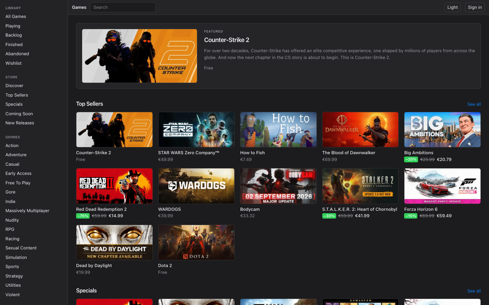
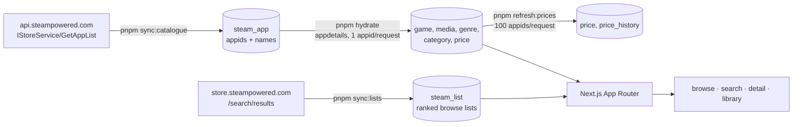
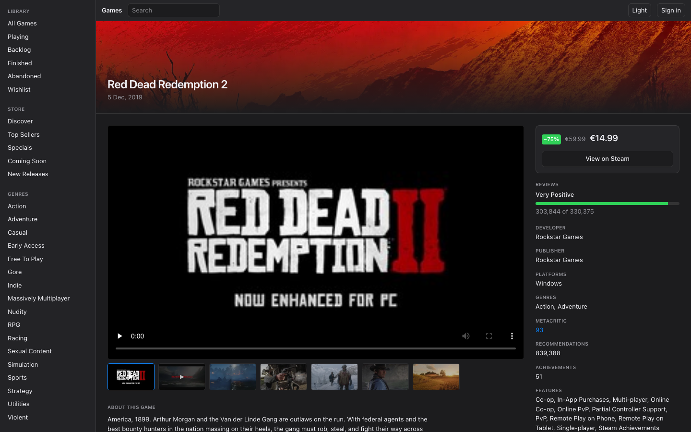
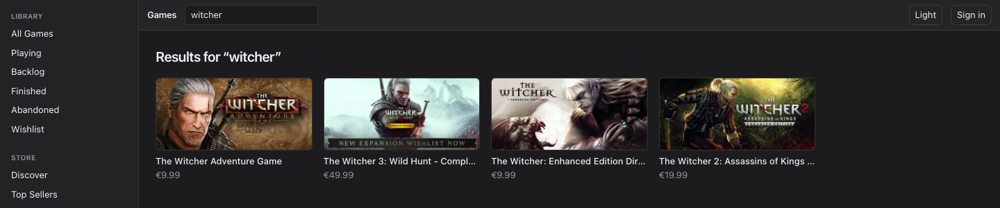

# games-db

A personal PC games catalogue. It indexes Steam's store, presents it in a macOS App Store-style
browsing UI, and lets a signed-in user keep a library of what they own, are playing, or want.

**Live:** https://games-db-phi.vercel.app



## What it is

Steam is the only source of catalogue data. The app stores users, library entries, a cache of
Steam responses, and — the part that shapes everything else — its own index of the Steam app
catalogue.

It is a personal project, not a product. It is Steam-only: no GOG, Epic, or itch data, and the
UI never implies otherwise.

## Why it can't be a thin API proxy

Steam has no endpoint equivalent to "give me action games released in 2026, sorted by rating,
page 3". There is no `/discover`, no `/trending`, and detail lookups are one appid per request
against an undocumented, rate-limited storefront API. A browse page that fanned out to Steam
per card would need hundreds of requests and would break the moment Valve throttled it.

So the app maintains its own index, and every browse, filter, and search query hits local
Postgres. Steam is called live only for a game the user explicitly opened whose cache row has
expired.



As of 2026-08-31 the index holds 245,025 known appids, of which 14,621 games are hydrated with
full detail, 9,937 carry a current price, and 9,965 price-history rows have accumulated.

## Screenshots

The detail page — trailer and gallery, aggregate review score, price with its discount, and the
facts rail:



Search runs on a Postgres trigram index, not on Steam:



## Stack

- **Next.js 16** (App Router) + **TypeScript**, server components by default
- **Tailwind CSS**
- **Neon Postgres** via **Drizzle ORM** and Drizzle Kit migrations
- **Auth.js** (NextAuth) with GitHub as the only sign-in provider
- **Vitest** for unit tests, **Playwright** for end-to-end
- Deployed on **Vercel**, and buildable as a single **Docker** image

## How the data gets in

Four jobs, each runnable locally, in the container, or from CI. All of them take an advisory
lock so two copies cannot run at once.

| Command | What it does |
| --- | --- |
| `pnpm sync:catalogue` | Pulls the full app list from `IStoreService/GetAppList` and upserts appids and names into `steam_app`. Games and DLC only — software, videos and hardware are excluded. Six requests at `max_results=50000`. Needs `STEAM_API_KEY`; the endpoint returns 403 without one. |
| `pnpm sync:lists` | Walks `store.steampowered.com/search/results` for the four ranked browse lists (top sellers, specials, coming soon, new releases) and replaces each list's membership in one transaction. The codebase's only HTML parse. |
| `pnpm hydrate` | Walks the pending queue and fills in detail from `appdetails`, one appid per request, under a self-imposed rate limit with backoff on 429. Flags: `--max-requests`, `--max-duration`, `--appid`, `--type=game\|dlc`. |
| `pnpm refresh:prices` | Refreshes prices in batches of 100 appids — the one `appdetails` call that accepts multiple appids — and appends to `price_history` only when a price actually changed. Flags: `--max-requests`, `--max-duration`. |

Rate limiting lives in one place, `server/steam/limiter.ts`; nothing else calls `fetch` against
Steam. The default of 1.2 requests per second is deliberately conservative: the highest rate
observed without a 429 was 1.86 req/s, which is a floor and not a measured ceiling. See
[the M3 observations](docs/superpowers/specs/2026-08-30-m3-observations.md) §2.

## Getting started

### Prerequisites

- Node 24 and pnpm 11 (`packageManager` pins the exact version)
- A Postgres database — Neon is what this runs on, but any Postgres with the `pg_trgm`
  extension available will do
- A Steam Web API key, for `sync:catalogue` only
- A GitHub OAuth app, for sign-in

### Environment

Copy `.env.example` to `.env.local` and fill it in:

| Variable | Purpose |
| --- | --- |
| `DATABASE_URL` | Pooled connection string. Used by the app. |
| `DATABASE_URL_UNPOOLED` | Direct connection. Used by migrations and the one-off jobs — not a precaution: the pooled endpoint hands the same advisory lock to two concurrent clients, so a job holding it there excludes nobody. |
| `STEAM_API_KEY` | Required for `sync:catalogue`. |
| `STEAM_COUNTRY_CODE` | Defaults to `cz`. |
| `STEAM_LANGUAGE` | Defaults to `english`. |
| `STEAM_STOREFRONT_RPS` | Storefront requests per second, defaults to `1.2`. |
| `AUTH_SECRET`, `AUTH_GITHUB_ID`, `AUTH_GITHUB_SECRET` | Auth.js and the GitHub OAuth app. |
| `AUTH_URL` | Container only — the public origin, no `/api/auth` suffix. Vercel infers it from request headers; leave it unset there. |

### Database and first run

```bash
pnpm install
pnpm db:migrate          # apply migrations
pnpm sync:catalogue      # populate steam_app
pnpm sync:lists          # populate the ranked browse lists
pnpm hydrate --max-duration=300   # fill in detail for a first slice of the queue
pnpm dev                 # http://localhost:3001
```

Hydration is deliberately slow — it is one request per appid under a rate limit — so the
catalogue fills in over repeated runs rather than in one pass. `pnpm db:studio` is the quickest
way to watch it land.

## Testing

```bash
pnpm test        # Vitest unit tests
pnpm test:e2e    # Playwright, against a local dev server it starts for you
pnpm test:db     # integration tests that need a real database
pnpm lint
pnpm typecheck
```

CI runs lint, typecheck, unit tests and the build on every pull request. Playwright is not in
CI: it needs a browser download and a reachable database, so it is run by hand.

## Docker

The app builds as a single image with `output: 'standalone'`, running as a non-root user. The
runtime stage also carries `db/` and `server/` so the catalogue jobs can be run as one-off
commands in the container, not only as scheduled CI.

```bash
docker build -t games-app .

# vercel env pull writes double-quoted values and docker --env-file does not strip quotes,
# so DATABASE_URL would arrive with literal quotes and every query would fail.
sed -E 's/^([A-Z_]+)="(.*)"$/\1=\2/' .env.local > .env.docker

docker run --env-file .env.docker -e AUTH_URL=http://localhost:3001 -p 3001:3000 games-app
```

`AUTH_URL` must match the origin the container is actually reached on. Without it Auth.js
rejects every request with `UntrustedHost`, and `AUTH_TRUST_HOST=true` is not a substitute — it
silences the error but leaves the callback URL pointing at `0.0.0.0`, which GitHub then refuses.

Migrations are an explicit step, never run on container start, so two containers starting at
once cannot race.

## Deployment

Production runs on Vercel from `main`. Prices refresh once a month through
[a GitHub Actions workflow](.github/workflows/refresh-prices.yml) (`0 3 1 * *`), which runs the
same `pnpm refresh:prices` command against the production database and is bounded by
`--max-duration` so it always ends green with durable partial progress. Monthly is a deliberate
choice for a portfolio app: nothing here is a live storefront, and freshness is worth what it
costs to automate and no more.

The catalogue jobs are not scheduled — they are run by hand when the index needs extending.

## Data model

Seventeen tables, defined in `db/schema.ts` and migrated with Drizzle Kit:

- `steam_app` — the local index of every known appid, with hydration state per row
- `steam_list` — membership and rank for the four ranked browse lists
- `game`, `game_media`, `genre`, `game_genre`, `category`, `game_category` — hydrated detail
- `price`, `price_history` — current price per country code, and a row appended on each change
- `review_summary` — aggregate review score only
- `library_entry`, `library_status_event` — a user's library and its transition history
- `users`, `accounts`, `sessions`, `verification_tokens` — Auth.js

`steam_appid` is the natural key for a game. Prices are stored as the minor-unit integer plus
the currency read from the payload — Steam prices Czechia in EUR, not CZK, so the currency is
never inferred from the country code.

**On review data:** only the aggregate `query_summary` is stored. Review bodies and author
identifiers are never fetched, because `num_per_page=0` means they never arrive in the first
place. They are personal data, and Steam gives no signal when a user edits or deletes a review,
so keeping them would create an erasure obligation this project cannot honour.

## Known limitations

- Steam-only, by design.
- The catalogue is a snapshot: nothing refreshes `steam_app` or the ranked lists on a schedule,
  so new releases appear only after a manual `sync:catalogue` and `sync:lists`.
- DLC has never been hydrated. The rows are indexed; their detail is not fetched.
- Coverage stops where it was called enough: games above appid 500k are still pending, where
  the released rate drops sharply.
- Delisted and region-locked apps return `success: false` or a null payload. That is handled as
  a normal case, not an error.
- Everything the storefront API does here is undocumented by Valve and can change without
  notice.

## Documentation

- [`CLAUDE.md`](CLAUDE.md) — the working agreement and the rules for changing this repo,
  including everything verified about Steam's actual behaviour
- [`docs/superpowers/specs/`](docs/superpowers/specs/) — the design document per milestone, plus
  [the M3 observations](docs/superpowers/specs/2026-08-30-m3-observations.md), which records
  what was measured live rather than assumed
- [`docs/superpowers/plans/`](docs/superpowers/plans/) — the implementation plan each milestone
  was built from

## Licence

[MIT](LICENSE). Steam artwork and store data belong to Valve and the respective publishers, and
are used here unmodified, linking back to the store page for each game.
